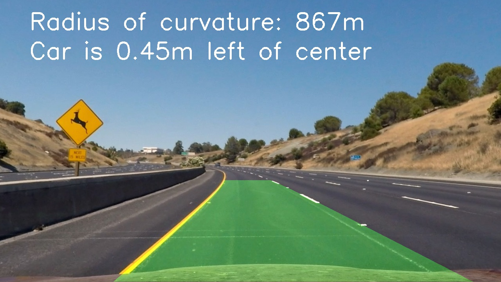

## Advanced Lane Finding

This Advanced Lane Finding project is part of the Udacitiy [Self-Driving Car Engineer Nanodegree](https://eu.udacity.com/course/self-driving-car-engineer-nanodegree--nd013).

 In the [Project Writeup](writeup.md) you can find a detailed review of the project goals, and how they were addresed.

Dependencies
---
* Python 3.6
* Numpy
* OpenCV
* Matplotlib
* Pickle

How to run
---

Run `python3 image_pypeline.py` and `python3 video_pipeline.py` to annotate images or videos respectively. 

The input images are in `/test_images` and on root folder for videos. The input file is coded and can be changed as described in the [Project Writeup](writeup.md).

The output is placed at `/output_images` and `output_videos`. 

The Project
---

The goals / steps of this project are the following:

* Compute the camera calibration matrix and distortion coefficients given a set of chessboard images.
* Apply a distortion correction to raw images.
* Use color transforms, gradients, etc., to create a thresholded binary image.
* Apply a perspective transform to rectify binary image ("birds-eye view").
* Detect lane pixels and fit to find the lane boundary.
* Determine the curvature of the lane and vehicle position with respect to center.
* Warp the detected lane boundaries back onto the original image.
* Output visual display of the lane boundaries and numerical estimation of lane curvature and vehicle position.

