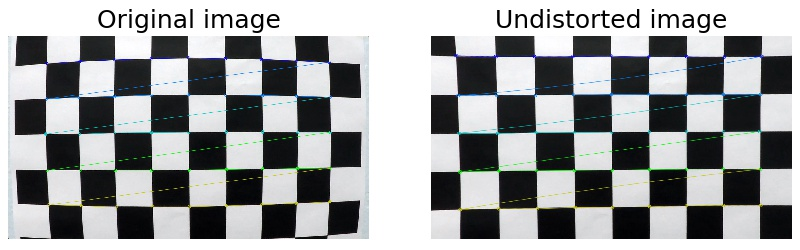
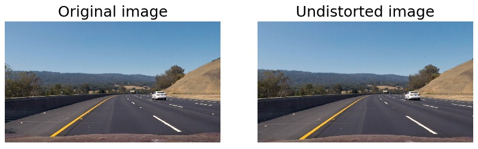
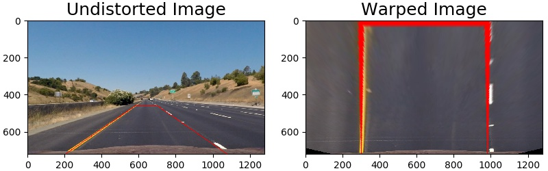
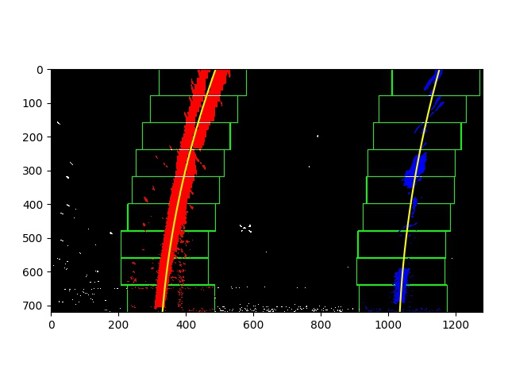
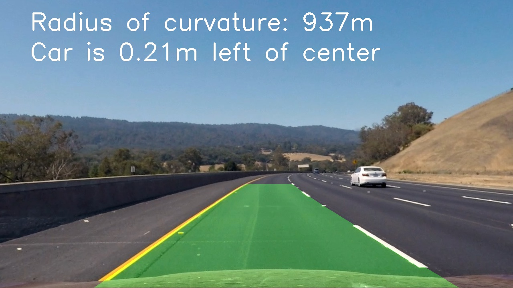

## Writeup for Advanced Lane Finding Project
   
This file provides a description of the project goals and how I fulfil them. The sections of this document are structured following the project's  [Rubric](https://review.udacity.com/#!/rubrics/571/view).


### Camera Calibration

 I use the graphics library OpenCV for camera calibration, and in further steps for lane recognition. OpenCV uses chessboard images as known pattern for calibration. Twenty figures of a chessboard in different angles are provided in the project.

The code for this step is contained in the file `camera_calibration.py`. OpenCV requires as input the coordinates of the chessboard corners in the real world (`objpoints`), and the coordinates of the corners upon the images (`imgpoints`). The object points coordinates are prepared assuming the chessboard is placed at z=0, and (x, y) are entire numbers of the respective location of each corner on the board. The image points are extracted with the function `cv2.findChessboardCorners()`.

I then used the output `objpoints` and `imgpoints` to compute the camera calibration and distortion coefficients using the `cv2.calibrateCamera()` function.  I applied this distortion correction to the test image using the `cv2.undistort()`, as shown below. The calibration matrix is saved in the file `calibrate_camera.p` for later use in the image and video pipelines. 



### Pipeline (single images)

The file `image_pipeline.py` contains the pipeline to find road lanes in a single image. Additional files provide functions for each step on the pipeline as follows:

- `image_thresholding.py`: Functions to apply different filters to the input image and return a thresholded binary image with the pixels that fullfil the filter
- `line_fit.py`: Functions to find the relevant pixels to our lanes, fit them to a 2nd order line, perform a sanity check on the fitted curves, and calculate their curvature
- `plotting _helpers.py`: Functions to plot the intermediate steps of the pipeline and help debugging

The pipeline consists of the following steps:

1. Correct the camera distorsion 
2. Apply filters to select the lane pixels 
3. Perspective transform to a bird-eye view
4. Obtain a polynomial fit of the road lanes
5. Calculate the road curvature and vehicle position on lane
6. Plot the results onto the original image

#### 1. Correct the camera distorsion

Right after loading the test image, the first step on lines #18 to #28, opens the saved calibration matrix and applies to the original image to get an undistorted image.  Finally I invoke the function I placed on `plotting_helpers.py` to plot both images and saved it to a file for use in this Writeup, as displayed below. This line can be commented to focus on later steps of the pipeline.



#### 2. Apply filters to select the lane pixels

I define the following thresholds: Gradient on X, gradient on Y, gradient magnitude, gradient direction, color saturation, color white, and color yellow. Some of these filters use code I programmed on the activities in lesson 8. I implemented the white and yellow filter to get a better result in the challenge video, and also apply nicely to the project video.

These threshold functions are defined on `image_thresholding.py`. After getting the binary maps for each filter, I combine them together, on line #42 of the pipeline, using this rule:
```
   combined[((mag_bin == 1) & (dir_bin == 1) & (hls_bin == 1)) | ((white_bin == 1) | (yellow_bin == 1))] = 1
```
Which translates to: I take the pixels that have a high gradient, provided they have the right direction, and have a defined saturation range. Then add the pixels that are yellow or white. The results of the different filters, their partial combinations and final combined results are:


#### 3. Perspective transform to a bird-eye view

The function `cv2.getPerspectiveTransform()` provides a transformation matrix, and requires as input a set of four points in the original image and their destination in the transformed image. 

These sets of points are hardcoded in the pipeline. The source points form a trapezoid onto the road section of the image, that transform to a square in the transformed image. To select these points I considered that parallel road lines will appear parallel from a bird-eye view. Also, I will choose later a conversion of 3.7 / 700 meters to pixels on the x-axis, being 3.7m the standard lane width on the U.S. Thus I fine tune my points to a lane width on 700 pixel. A final boundary condition is that the curvature on the project video is close to one kilometer. A final and small fine-tuning was done on the video analysis to consider this.

The source and destination points, defined in lines #52 to #61, are:

| Source        | Destination   | 
|:-------------:|:-------------:| 
| (205, 720)    | (300, 720) | 
| (1075, 720)  | (980, 720) |
| (700, 460)    | (980, 0)    |
| (580, 460)    | (300, 0)    |

On the image below the condition of parallelity and the lanes being around 700 pixels apart, are apparent. I apply the same warping to the binary image result of combining filters in the last step.



#### 4. Obtain a polynomial fit of the road lanes

I used the method descrided in lesson 9 to search the lane position in the warped binary output from last step.

First a frequency histogram of the bottom half of the image reveal the lane coordinates at the bottom by the histogram maximums on each half of the screen. I go up the image and collect the pixels inside a number of regions that will cover the total height. Each region can be relocated horizontally if the pixels on the previous region were shifted to one side. This method allows to follow the bends on the road.

This functionality is enabled in `line_fit.py`, functions `fit_polynomial()` and `find_lane_pixels()`, which are called on the pipeline at line #74

The pixels inside these boxes are selected and fitted using `np.polyfit()`, as shown here:



After getting our two lanes a sanity check is performed, implemented in function `sanity_chk()` on `line_fit.py`. It will check if the lane width and lanes parallelity are within reasonable values, and report an error message if not.

#### 5. Calculate the road curvature and vehicle position on lane

This step is found on line #81 of the pipeline. The function `find_curv()` is located on `line_fit.py`. It uses the following equation to calculate the radius of curvature:
$$R_{curve}=\frac{(1+(2Ay+B)^2)^{3/2}}{|2A|}$$
Being the fitted line expresion: *f(y) = Ay<sup>2</sup> + By + C*. The funtion calculates the curvature for both lane and these are averaged for the final value of road curvature.

The lane width and car offset are calculated from the position of the fitted lanes at the bottom of the screen, and the screen width on lines #84, #85

#### 6. Plot the results onto the original image

I used the implementation suggested in the project tips on lines #94 through #112, by creating a new warped image with the fitted lines. It is unwarped by the inverse transformation matrix calculated in step 3, and superimposed to the undistorted image from step 1. Also, information text on the curvature and car offset is added using `cv2.putText()`.

Here is an example of my result on a test image:



---

### Pipeline (video)

After observing difficulties visualizing mp4 videos on the browser in GitHub, I provide my output videos in a second backup format webm (albeit with lower quality). Both formats show the same video, which should run when downloaded locally.

- [ project video result (mp4)](output_videos/project_video_output.mp4)
- [ project video result (webm)](output_videos/project_video_output.webm)

The code in the image pipeline was reused for the video pipeline (`video_pipeline.py`). This was good to achieved the accuracy shown in the link above. However, when attacking the `challenge_video.mp4`, the pipeline was not able to achieve decent accuracy. Apart from the white and yellow filters mentioned on the step2, I made the following improvements to the video pipeline:

- Instead of searching the lane pixels in step 4 for every frame, I used the lane position found on previous frames as guide. The search region was limited to 100 pixels around the previous fitted lanes. This method improved the speed of video annotation. To store the previous frame's information I create a Line object on `Line.py`

- If the lane positions don't pass the quality check, the position is skipped and I continue using the one of the previous frame. If this happens for 5 consecutive frames it means that the lane's position has wandered too far away from the searching window, and I do a full search as described in the image pipeline.

- For more robutness of the lane position, I use an average of the last 4 frames with correct line fitting.

While not perfect, the pipeline is able to annotate the challenge video most os the time. 
- [challenge video result (mp4)](output_videos/challenge_video_output.mp4)
- [challenge video result (webm)](output_videos/challenge_video_output.webm)

---

### Discussion

Here I want to highlight the following points:

- I implemented white and yellow filters to overcome the difficulty of the pipeline detecting cracks on the road as lanes, due to their high gradient. Discarding those pixels through the saturation filter also discarded most of the lane pixels. Adding a portion of white and yellow pixels produce enough correct data to fit. However, white (or yellow) cars on the road would confuse this method, and is the origin of some wobbling seen in the challenge video.

- Although some frames are recognized on `harder_challenge_video.mp4` ([mp4](output_videos/harder_challenge_video_output.mp4), [webm](output_videos/harder_challenge_video_output.webm)), there is much improvement needed to achieve a decent lane annotation. Two ideas come to mind:
	- The different ilumination conditions present in the same video is the bigger challenge.The filters to select the relevant pixels on step 2 have hardcoded thresholds that work well in certain illumination conditions, but not so well on others. I would improve this by introducing an image preprocessing step that delivers more uniform images to the filters (currently only RGB to GRAY is done).
	- On very close bends the lanes go out of the screen on the side, with one lane even totally disappearing at one point. The search algorithm needs to recognize here that the lane ends at the side of the screen and stop seachring in a region above. Also, the two lanes can be treated more separately and allow only one lane to be processed. Currently the quality check discard the frame based on the respective positions of the two lanes, and fails if one one lane is in the wrong.
	
- Methods of object recognition, using Neural Networks, would allow to detect cars and other objects, and discard their pixels from the lane recognition pipeline.


